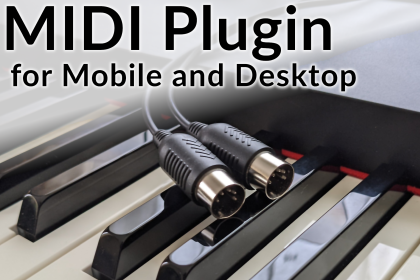

# Unity MIDI Plugin supports
  
Documents and issues for Unity MIDI Plugin

Unity MIDI Plugin is available on the Asset Store.  
https://u3d.as/2CTe

On Unity China Asset Store is also available.  
https://assetstore.u3d.cn/packages/slug/20002327

## Plugin demo
Latest sample scene's WebGL build  
https://kshoji.github.io/Unity-MIDI-Plugin-supports/

## Documents
- [Document in English](documents/MIDI-Plugin-for-Mobile-and-Desktop.md) / [[PDF]](documents/MIDI-Plugin-for-Mobile-and-Desktop.pdf)
- [日本語ドキュメント](documents/MIDI-Plugin-for-Mobile-and-Desktop-JP.md) / [[PDF]](documents/MIDI-Plugin-for-Mobile-and-Desktop-JP.pdf)
- [中文手册(翻译)](documents/MIDI-Plugin-for-Mobile-and-Desktop-CN.md) / [[PDF]](documents/MIDI-Plugin-for-Mobile-and-Desktop-CN.pdf)

## Ask to AI
I've created an AI chat that registers this manual.  
If you have any questions, please use this tool first. (A Google account is required.)  
- [Notebook LM(English)](https://notebooklm.google.com/notebook/c98f2512-35e0-4396-9a9d-686f662b6f4a)
- [Notebook LM(日本語)](https://notebooklm.google.com/notebook/10ea85d5-92d8-4225-bd8b-b24e4e1bf747)
- [Notebook LM(中文)](https://notebooklm.google.com/notebook/12f7cab5-0554-4f42-9f26-71f2f3507b1b)

## Supports
Go [issues](https://github.com/kshoji/Unity-MIDI-Plugin-supports/issues) to report problems or ask questions.
